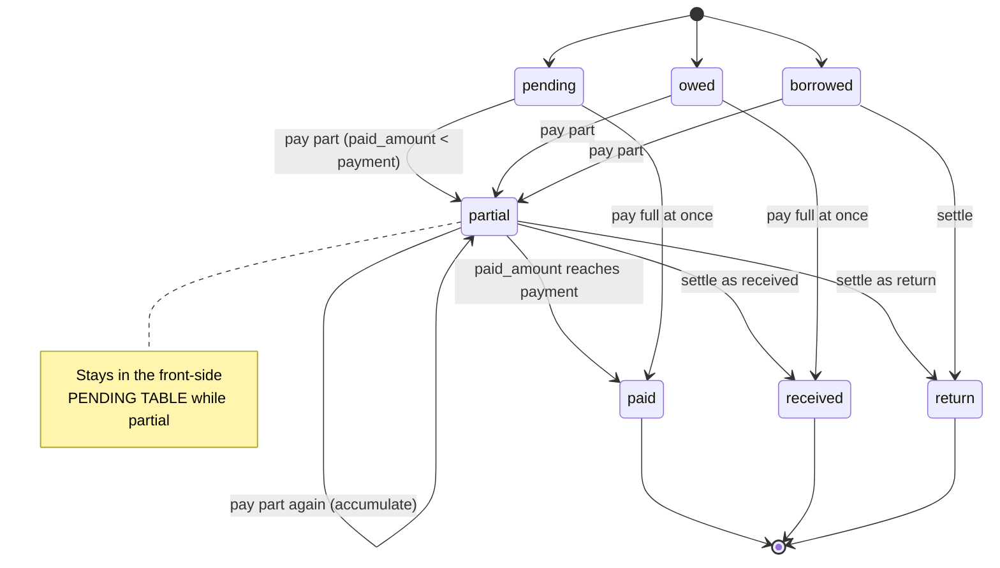
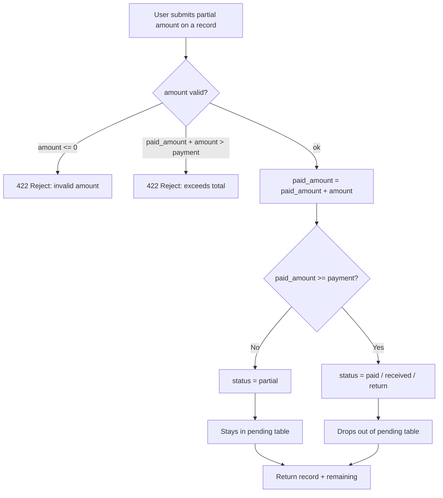
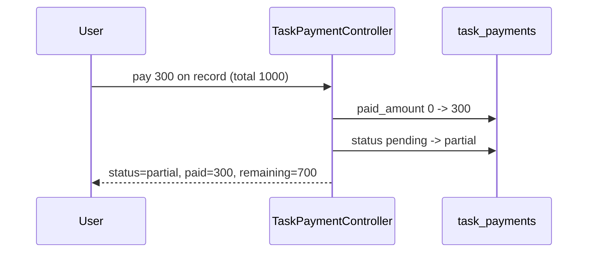
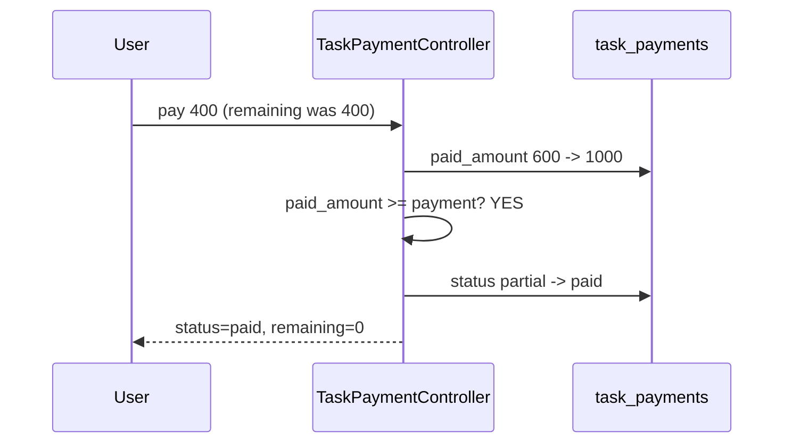

# Partial Payment Feature — Design & Scenarios

Status: **Implemented** (migration `2026_07_24_100000_add_partial_payment_to_task_payments_table`)
Table: `task_payments`
Model: `App\Models\TaskPayment`
Controller: `App\Http\Controllers\TaskPaymentController`

---

## 1. Purpose

Let a user pay a payment record **in parts** over time. A record that is not yet
fully paid shows a new status **`partial`** and stays in the pending list until the
full amount is cleared. Once cleared it becomes a settled status
(`paid` / `received` / `return`) and drops out of the pending list.

---

## 2. Schema Changes

| Column           | Before            | After                                              |
| ---------------- | ----------------- | -------------------------------------------------- |
| `payment`        | `string`          | `decimal(10,2)` (total amount)                     |
| `paid_amount`    | —                 | **NEW** `decimal(10,2)` default `0` (accumulated)  |
| `payment_status` | enum (6 values)   | enum + `partial` (7 values)                        |

**Enum after change:**

```
pending, paid, owed, received, borrowed, return, partial
```

**Derived (not stored), returned in API:**

```
remaining = payment - paid_amount
```

---

## 3. Status Lifecycle



**Pending table (`getTasks`) shows:** `pending`, `owed`, `borrowed`, **`partial`**
**Settled (hidden from pending table):** `paid`, `received`, `return`

---

## 4. Core Submit Logic (top-up / accumulate)



**Rules**

1. Each partial submit does `paid_amount += amount`.
2. `amount > 0` and `paid_amount + amount <= payment` (no overpay).
3. When `paid_amount >= payment` → auto-flip to a settled status.
4. A record that is already settled (`paid`/`received`/`return`) rejects further top-ups.

---

## 5. Every Scenario

### Scenario A — New record, no partial (baseline)

```
Create: payment=1000, status=pending, paid_amount=0
Result: shows in pending table, remaining=1000
```

### Scenario B — First partial payment

```
Start:  payment=1000, status=pending, paid_amount=0
Action: pay 300
After:  paid_amount=300, status=partial, remaining=700
Table:  STILL in pending table (partial)
```



### Scenario C — Multiple partial payments (accumulate)

```
Start:  payment=1000, status=partial, paid_amount=300
Action: pay 200
After:  paid_amount=500, status=partial, remaining=500
Action: pay 100
After:  paid_amount=600, status=partial, remaining=400
Table:  STILL in pending table each time
```

### Scenario D — Final payment completes it (auto-flip)

```
Start:  payment=1000, status=partial, paid_amount=600
Action: pay 400  (exact remaining)
After:  paid_amount=1000, status=paid, remaining=0
Table:  REMOVED from pending table (settled)
```



### Scenario E — Pay full in one go (never partial)

```
Start:  payment=1000, status=pending, paid_amount=0
Action: pay 1000
After:  paid_amount=1000, status=paid, remaining=0
Note:   goes straight to paid, never touches partial
```

### Scenario F — Overpay rejected

```
Start:  payment=1000, status=partial, paid_amount=800
Action: pay 300   (would make 1100 > 1000)
Result: 422 Rejected — amount exceeds remaining (200)
State:  unchanged (paid_amount stays 800)
```

### Scenario G — Settle a partial as RETURN

```
Start:  payment=1000, status=partial, paid_amount=600
Action: settle as return
After:  status=return  (record closed)
Table:  REMOVED from pending table
Note:   business decides how paid_amount 600 is treated on return
```

### Scenario H — Settle a partial as RECEIVED

```
Start:  payment=1000, status=partial, paid_amount=1000
Action: paid_amount reached full, chosen settle = received
After:  status=received, remaining=0
```

### Scenario I — Top-up on already-settled record (blocked)

```
Start:  payment=1000, status=paid, paid_amount=1000
Action: pay 100
Result: 422 Rejected — record already settled
```

---

## 6. Earnings Summary (`earningSummary`)

Partial records must be split by **amount**, not counted as a whole row.

```mermaid
flowchart LR
    subgraph Partial record: payment=1000, paid_amount=600
        P1[paid_amount 600] --> EARNED[Available / Earned]
        P2[remaining 400] --> PENDING[Pending]
    end
```

| Bucket             | Includes                                                              |
| ------------------ | -------------------------------------------------------------------- |
| Available / earned | full `paid`/`received` amounts **+** `paid_amount` of partial rows    |
| Pending            | full `pending`/`owed` amounts **+** `(payment - paid_amount)` partial |
| Net earning        | earned + settled inflows per existing rule (partial counts paid part) |

**Example**

```
Record 1: paid,     payment=500,  paid_amount=500
Record 2: partial,  payment=1000, paid_amount=600
Record 3: pending,  payment=300,  paid_amount=0

Available = 500 + 600            = 1100
Pending   = (1000-600) + 300     = 700
```

---

## 7. API Response Shape (proposed)

```json
{
  "status": true,
  "message": "Record saved successfully",
  "task_payment": {
    "id": 12,
    "payment_title": "Website design",
    "payment": "1000.00",
    "paid_amount": "600.00",
    "remaining": "400.00",
    "payment_status": "partial",
    "create_date": "2026-07-24"
  }
}
```

---

## 8. Files to Change (implementation checklist)

- [x] Migration: alter `payment` to `decimal`, add `paid_amount`, extend enum with `partial`
- [x] `TaskPayment` model: add `paid_amount` to `$fillable`, `remaining` accessor, decimal casts
- [x] `TaskPaymentController@taskPayment`: top-up logic, overpay guard, auto-flip, settled-lock
- [x] `TaskPaymentController@getTasks`: add `partial` to the pending filter
- [x] `TaskPaymentController@earningSummary`: split partial by column (paid vs remaining)
- [x] `lang/en` + `lang/ur` messages: add `partial` label
- [x] Admin UI: `partial` badge + `paid / total (remaining)` on Job Details and Job Monitoring
- [x] Admin **record partial payment** form on Job Details (per non-settled record)
- [x] Shared top-up logic: `TaskPayment::applyPayment()` — used by both API and admin

---

## 9. Impact Analysis — No Conflict With Existing App

This feature is **purely additive**. Every existing query filters for specific status
values, so a new enum value `partial` cannot break them, and a new `paid_amount`
column (default `0`) leaves all existing rows valid.

| Location                                   | What it does                        | Impact                                   |
| ------------------------------------------ | ----------------------------------- | ---------------------------------------- |
| `ActivityService.php:22,69`                | Admin dashboard sums `paid`         | Safe — ignores `partial` until settled   |
| `TaskController.php:206`                   | Creates payment as `pending`        | Safe — unchanged                         |
| `TaskController.php:433`                   | Reads status, defaults `pending`    | Safe — unchanged                         |
| `AdminJobMonitoringController.php:58`      | Selects column for display          | Safe — just shows the value              |
| `getTasks` / `earningSummary` / validation | Filter specific statuses            | Updated by this feature (see checklist)  |

**Only changed behaviour:** the methods listed in the checklist (§8).
**Data-migration care point:** `payment` `string` -> `decimal(10,2)` — existing values
are numeric strings (set via `numeric` validation) so conversion is safe; verify data
before running the alter. No other existing behaviour changes.

---

## 10. Open Business Questions (defaults applied — confirm with client)

1. On **`return`** of a partial record, how is the already-paid `paid_amount` treated?
   **Default applied:** `paid_amount` is kept as recorded (no auto-refund logic).
2. When a partial reaches full, which settled status is the default?
   **Default applied:** `paid`, unless the request passes an explicit settle status
   (`received` / `return`).
3. Can a user **reduce** `paid_amount` (correction)?
   **Default applied:** add-only — top-ups only, no reduction. A settled record is locked.

---

## 11. API Usage (implemented)

Single endpoint `taskPayment` handles create, top-up, and status update.

**Make a partial payment (top-up an existing record):**
```
POST  { "id": 12, "paid_amount": 300 }
-> paid_amount += 300; status becomes 'partial' (or 'paid' if it reaches the total)
```

**Settle a partial as received/return when it completes:**
```
POST  { "id": 12, "paid_amount": 400, "payment_status": "received" }
-> if this clears the balance, status = received; otherwise stays partial
```

**Create a record already part-paid:**
```
POST  { "payment_title": "...", "payment": 1000, "paid_amount": 300 }
-> status = partial, remaining = 700
```

**Guards:** `paid_amount` must be > 0 and cannot push the total over `payment`
(422 "Amount exceeds the remaining balance"); a settled record rejects further
top-ups (422 "already settled").

---

## 12. Admin Panel (implemented)

Admins can **view and record** partial payments from the Job Details page — no
mobile app needed.

- **Job Monitoring list** — `partial` shows a blue badge with `paid / total`.
- **Job Details** — `partial` shows a blue badge with `paid / total (remaining)`.
- **Record Partial Payment table** (Job Details) — one row per non-settled payment
  (`pending / owed / borrowed / partial`) with total / paid / remaining and an
  amount input. Submitting posts to `admin.payments.recordPartial` and applies the
  **same** `TaskPayment::applyPayment()` logic as the API (overpay + settled guards,
  auto-flip to `paid`). Settled records show no form. Success/error is flashed back.

Route: `POST /admin/payments/{payment}/record-partial` -> `AdminJobMonitoringController@recordPartialPayment`

> Both the app API and the admin panel call one shared method
> `TaskPayment::applyPayment()`, so the money rules can never drift between them.
